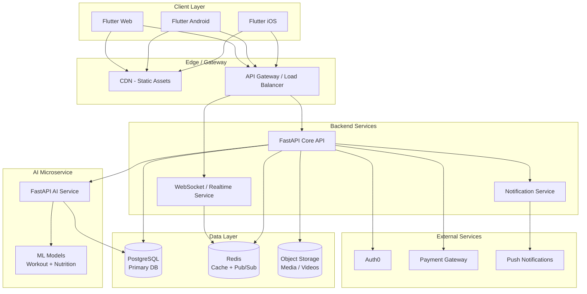
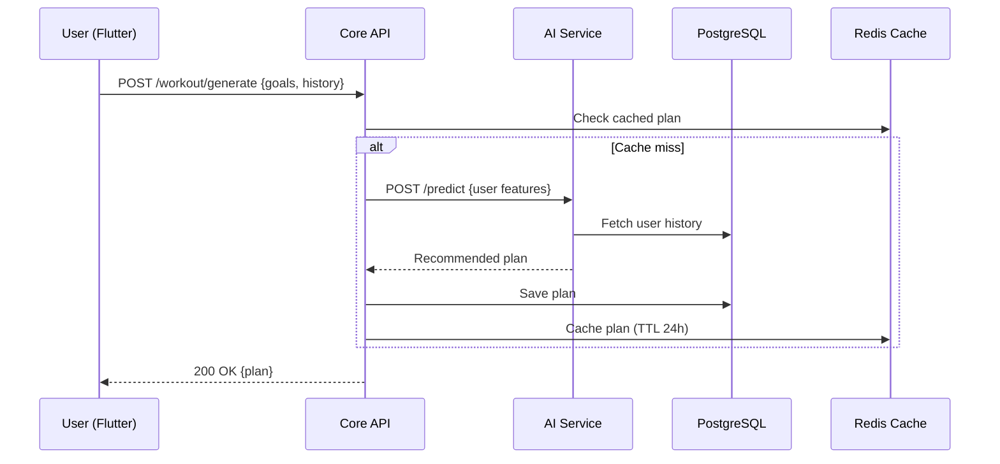
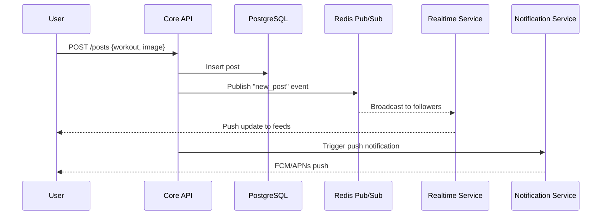
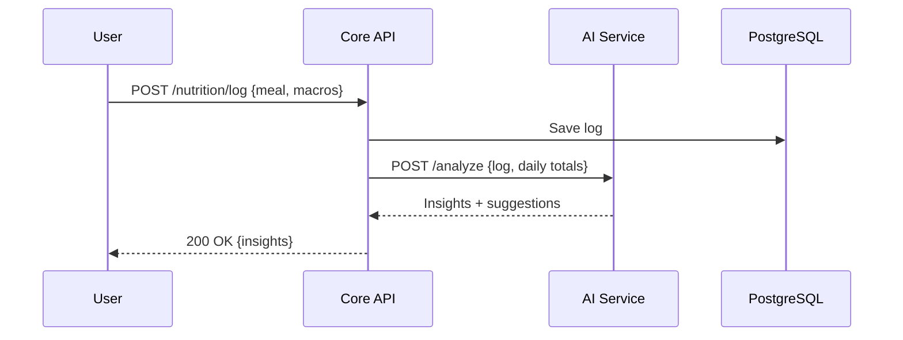

# High-Level Architecture — FitFlow Redesign

**IT3060 — Human Computer Interaction | Lab Exercise 05**
**Activity 4: System Architecture**

---

## 1. Architecture Overview

FitFlow uses a **microservice-oriented architecture** with a cross-platform Flutter client, a Python/FastAPI core API, a dedicated AI microservice, PostgreSQL as the primary datastore, and Redis for caching and real-time pub/sub.



---

## 2. Key Components

| Component              | Technology              | Responsibility                                      |
|------------------------|-------------------------|-----------------------------------------------------|
| Client                 | Flutter                 | iOS, Android, Web UI                                |
| API Gateway            | Nginx / Cloud LB        | Routing, rate limiting, TLS termination             |
| Core API               | Python / FastAPI        | Business logic, CRUD, orchestration                 |
| Realtime Service       | FastAPI + WebSockets    | Live workouts, chat, social feed                    |
| AI Microservice        | FastAPI + Python ML     | Personalized plans, nutrition analysis              |
| Primary Database       | PostgreSQL              | Users, workouts, nutrition logs, social data        |
| Cache / Pub-Sub        | Redis                   | Sessions, leaderboards, real-time events            |
| Object Storage         | S3 / GCS                | Videos, images, user avatars                        |
| Authentication         | Auth0                   | OAuth2, MFA, SSO, JWT issuance                      |
| Notifications          | FCM / APNs              | Push notifications                                  |

---

## 3. Critical Data Flows

### 3.1 Personalized Workout Plan



### 3.2 Social Sharing



### 3.3 Nutrition Tracking



---

## 4. Security Considerations

- **Transport:** TLS 1.3 everywhere (HTTPS + WSS).
- **Auth:** Auth0-issued JWTs, short-lived access tokens, refresh token rotation.
- **Authorization:** Role-based access control (RBAC) — user, coach, admin.
- **Data at Rest:** PostgreSQL encryption at rest (AES-256); S3 SSE.
- **Compliance:** HIPAA-aligned audit logs; GDPR data export + right-to-be-forgotten endpoints.
- **Secrets:** Managed via AWS Secrets Manager / HashiCorp Vault.
- **Rate Limiting:** Redis-backed per-user + per-IP throttling at the gateway.

---

## 5. Scalability Considerations

- **Horizontal scaling:** Stateless FastAPI pods behind a load balancer (Kubernetes / ECS).
- **Database:** Read replicas for analytics; partitioning of large tables (nutrition logs).
- **Cache:** Redis cluster mode for high throughput.
- **AI service:** Separate autoscaling group — GPU-enabled nodes if needed.
- **CDN:** Static assets and media served via CDN to reduce origin load.
- **Async work:** Background jobs (email, notifications, ML training) via Celery or Arq.

---

## 6. Integration Considerations

- **CI/CD:** GitHub Actions → Docker → container registry → deployment.
- **Observability:** Prometheus + Grafana (metrics), Loki / ELK (logs), OpenTelemetry (traces).
- **Versioning:** API versioned via `/api/v1/...` prefix.
- **Feature flags:** LaunchDarkly or Unleash for progressive rollout.
- **Testing:** Unit + integration (pytest), E2E (Flutter integration_test), load (k6).

---

## 7. Deployment Topology (High-Level)

```
[ Flutter App ] ──► [ CDN ] ──► [ API Gateway ]
                                     │
              ┌──────────────────────┼──────────────────────┐
              ▼                      ▼                      ▼
        [ FastAPI Core ]      [ Realtime WS ]        [ AI Service ]
              │                      │                      │
              └──────────┬───────────┴──────────┬───────────┘
                         ▼                      ▼
                    [ PostgreSQL ]         [ Redis ]
                         │
                    [ S3 / GCS ]
```